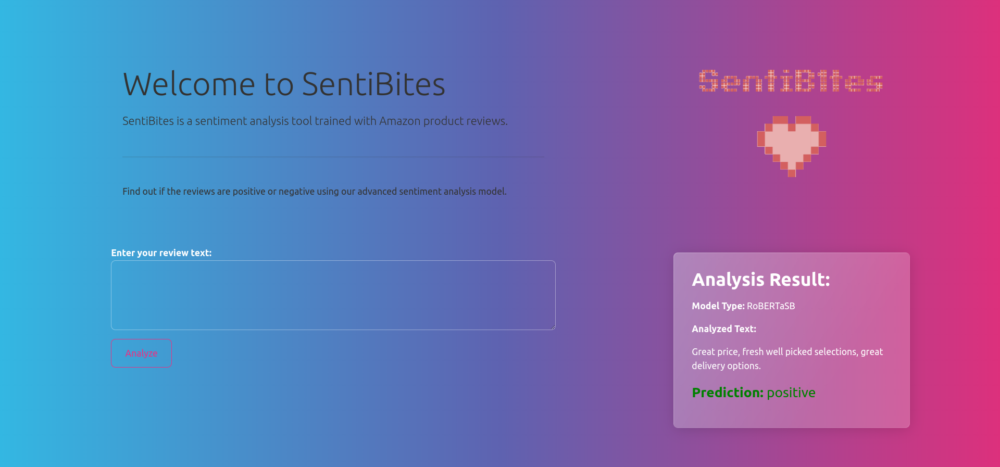

# MLOPS-SentiBites


The goal of this project is to deploy a sentiment analysis model by using the best practices in MLOPS.
The base model is a [Roberta](https://huggingface.co/docs/transformers/model_doc/roberta) which will be finetuned on an [Amazon reviews dataset](https://www.kaggle.com/datasets/snap/amazon-fine-food-reviews?select=Reviews.csv).

## Cards

You can find the cards here :

- [Dataset card](./docs/dataset_card.md)
- [Model card](./docs/model_card.md)

## Installation

1. Cloning the repository
```sh
git clone https://github.com/MLOps-essi-upc/MLOps-SentiBites.git
```

2. Install requirements
```sh
pip install -r requirements.txt
```

3. Pull data from Dagshub
```sh
dvc pull -r origin
```

4. Launch the tests
```sh
pytest tests/
```


## Deployment with Docker

You have two possibilities :

**Pull the latest container from our DockerHub repo (recommended):**

1. Pull the container
```sh
docker pull rudiio/sentibites:latest
```

2. Run the container
```sh
docker run -p 5000:5000 -p 8000:8000 rudiio/sentibites:latest
```

**Build a new docker image on your machine.**

1. Build the project with the instruction given in the previous section

2. Create the docker image

```sh
docker build -t sentibites:x.x .
```

2. Run the container
```sh
docker run -p 5000:5000 -p 8000:8000 sentibites:x.x
```

## Usage

### Usage without App

For training :

```sh
python3 src/models/train_model.py --model "roberta-base" --dataset data/processed --output_dir run1 --logging_dir logs --epochs 1 --learning_rate 0.001 --weight_decay 0.005
```

For inference :

```sh
python3 src/models/predict_model.py --model "models/SentiBites" --input "text"
```

For evaluation :

```sh
python3 src/models/evaluate_model.py
```

###  Running the App 

You can run the app on local with the following command :

```sh
python3 run_servers
```

that will run the backend on **locahost:8000** and the frontend on **localhost:5000**.


Here is a preview of the our application : 




###  DVC repro and stages

Data processing stage:

```sh
dvc stage add -n data-processing \
    -d src/data/make_dataset.py \
    -d data/raw/Reviews.csv \
    -o data/processed/train.csv \
    -o data/processed/test.csv \
    python3 src/data/make_dataset.py
```

Training stage:

```sh
dvc stage add -n training \
    -d src/data/train_model.py \
    -d data/processed/train.csv \
    -d data/processed/test.csv \
    -o models/SentiBites \
    -o metrics/emissions.csv \
    python3 python3 src/models/train_model.py --model "roberta-base" --dataset data/processed \
    --output_dir SentiBites1 --logging_dir logs --epochs 1 --learning_rate 0.001 --weight_decay 0.005
```

Evaluation stage:

```sh
dvc stage add -n evaluation \
    -d src/models/evaluate_model.py \
    -d data/processed/test.csv \
    -d models/SentiBites \
    -m metrics/evaluation_scores.csv \
    python3 src/models/evaluate.py --model models/SentiBites --dataset data/processed \
```

